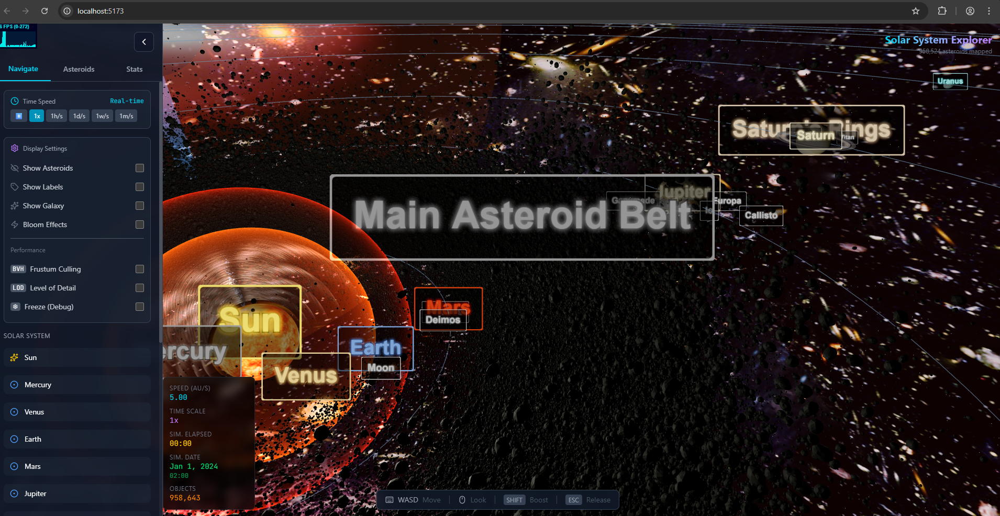

# (Sara Info Version) Map The Solar System - Clean from Laggy Asteroids!

My own model of the solar system, galaxy and the multiverse!

NEW: You can now click on Earth!

## Previews:

Video Preview: https://vimeo.com/1180406387


Old version:



## Credits:

Burgil

## Planets Textures Credits:

Pablo Carlos Budassi created a dazzling logarithmic visualization of the observable universe in 2013. (Image credit: Pablo Carlos Budassi/Wikimedia Commons)

Earth textures: [PlanetPixelEmporium](https://planetpixelemporium.com/earth.html)

🖼️ Textures & Assets
Planet and sun textures were sourced from:
https://www.solarsystemscope.com/textures/

## How to use?

use pnpm instead of npm but you don't have too, because it's way safer to use pnpm because it doesn't run `postinstall`

Get node: https://nodejs.org/en/download/current

Optionally get pnpm: https://pnpm.io/installation

or remove the p and just use npm if you really want too.. but it's not recommended!

```
pnpm install
or
npm install

pnpm dev
or
npm run dev
```

## How to deploy to a website?

```
pnpm build
npx wrangler pages deploy dist
>
https://sarainfo.pages.dev/
```

If you already published and you want to have a custom domain e.g. .com or change the temporary domain e.g. .pages.dev then you can delete the .wrangler and the node_modules folder or access dash.cloudflare.com and set up a domain there for free!